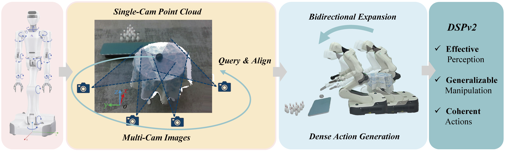

# DSPv2: Improved Dense Policy for Effective and Generalizable Whole-body Mobile Manipulation

<!-- [](https://arxiv.org/abs/2503.13217) [](https://selen-suyue.github.io/DspNet/) []() -->

**Authors**: <a href="https://selen-suyue.github.io" style="color: maroon; text-decoration: none; font-style: italic;">Yue Su</a><sup></sup>,
<a href="https://lin-shan.com/" style="color: maroon; text-decoration: none; font-style: italic;">Chubin Zhang</a><sup></sup>,
<a href="https://ch3cook-fdu.github.io/" style="color: maroon; text-decoration: none; font-style: italic;">Sijin Chen</a>,
<a href="" style="color: maroon; text-decoration: none; font-style: italic;">Liufan Tan</a>,
<a href="https://andytang15.github.io/" style="color: maroon; text-decoration: none; font-style: italic;">Yansong Tang</a>,
<a href="https://scholar.google.com/citations?user=mt5mvZ8AAAAJ&hl=en" style="color: maroon; text-decoration: none; font-style: italic;">Jianan Wang</a>,
<a href="https://xh-liu.github.io/" style="color: maroon; text-decoration: none; font-style: italic;">Xihui Liu&dagger;</a><sup></sup>


## 🛫 Getting Started
We have introduced both [DINOv3 (As Default)](https://github.com/facebookresearch/dinov3) and [DINOv2](https://github.com/facebookresearch/dinov2) as the 2D Encoder here. You can refer [policy](policy/policy.py) and [v_model](policy/v_model.py) to look up and change the setup. 

The v1 version of DSP: [Dense Policy](https://selen-suyue.github.io/DspNet/). You can use its [Dense Head](https://github.com/Selen-Suyue/DensePolicy/blob/main/policy/dense_policy.py) for action generation easily.

### ⚡️ Quick Follow
Refer [policy](policy/policy.py) to follow DSPv2 easily and smoothly.

### 💻 Installation

Please following the [installation guide](assets/docs/INSTALL.md) to install the `dspv2` conda environments and the dependencies. Also, remember to adjust the constant parameters in [`dataset/constants.py`](dataset/constants.py) according to your own environment.

### 🛢️ Data 

Our original datasets are collected and organized by hdf5.
Each demo(trajectory) is formulated like:
```
├─ Group: /images_dict
  ├─ Group: /images_dict/head
    └─ Dataset: depth (Shape: (174, 720, 1280), Dtype: uint16)
    └─ Dataset: rgb (Shape: (174, 720, 1280, 3), Dtype: uint8)
    └─ ...
  ├─ Group: /images_dict/left
    └─ ...
  ├─ Group: /images_dict/right
    └─ ...
  ├─ Group: /images_dict/torso
    └─ ...
├─ Group: /joints_dict
  └─ Dataset: joints_position_state (Shape: (174, 25), Dtype: float64)
  └─ ...
├─ Group: /poses_dict
  └─ Dataset: astribot_arm_left (Shape: (174, 7), Dtype: float64)
  └─ Dataset: astribot_arm_right (Shape: (174, 7), Dtype: float64)
  └─ ...
  └─ Dataset: merge_pose (Shape: (174, 37), Dtype: float64)
├─ ...
```
where we use the multi-view images and head-cam depth, `pose_dict/merge_pose` is used for organize state and actions, which serves as a combination of
`[chassis pose, torso pose, left arm pose, left gripper, right arm pose, right gripper, head pose]`. They are all relative pose to the chassis. The chassis's movement is based on the world frame, saved as the first 3 dimension in `joints_dict/joints_position_state`. You can ignore other data in hdf5.

As for the point cloud projection, sampling in conventional methods, voxelization in DSPv2, are provided in [`dataset/preprocess_data.py.py`](dataset/preprocess_data.py). It also provides a function for calculating delta of chassis movement. Using [`dataset/preprocess_data.py.py`](dataset/preprocess_data.py) to process data is essential for accelerating training.


### 🧑🏻‍💻 Training
Before training, we recommend to calculate the 5%-95% min-max value of each task for normalization. For each task, just follow [`utils/minmax.py`](utils/minmax.py) and save the value in [`dataset/pose.json`](dataset/pose.json), named as `your_task_name`. Add `--task your_task_name` in `train.sh`. Then embark your training:

```bash
conda activate dspv2
bash train.sh
```

### 🤖 Evaluation

```bash
conda activate dspv2
python eval.py
```

## ✍️ Citation

<!-- ```bibtex
@article{su2025dense,
  title={Dense Policy: Bidirectional Autoregressive Learning of Actions},
  author={Su, Yue and Zhan, Xinyu and Fang, Hongjie and Xue, Han and Fang, Hao-Shu and Li, Yong-Lu and Lu, Cewu and Yang, Lixin},
  journal={arXiv preprint arXiv:2503.13217},
  year={2025}
}
``` -->

## 📃 License

<p xmlns:cc="http://creativecommons.org/ns#" xmlns:dct="http://purl.org/dc/terms/"><a property="dct:title" rel="" rel="cc:attributionURL" href="">DSPv2</a> is licensed under <a href="https://creativecommons.org/licenses/by-nc-sa/4.0/?ref=chooser-v1" target="_blank" rel="license noopener noreferrer" style="display:inline-block;">CC BY-NC-SA 4.0</a></p>